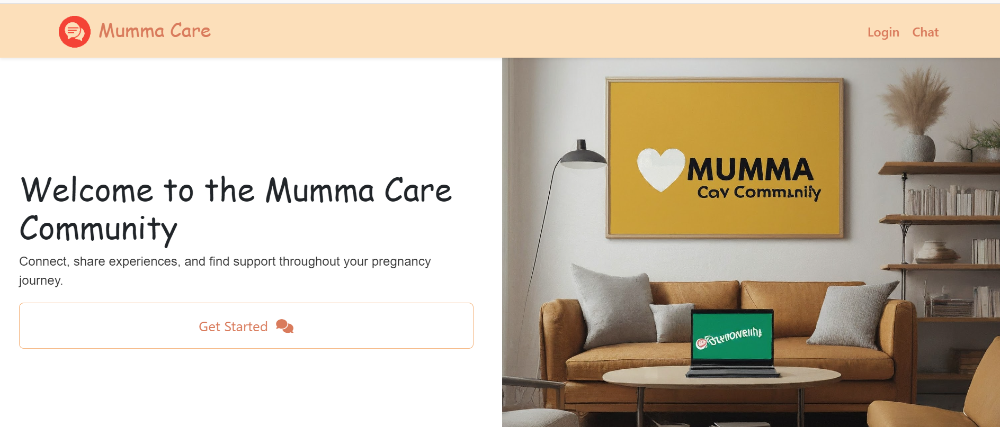
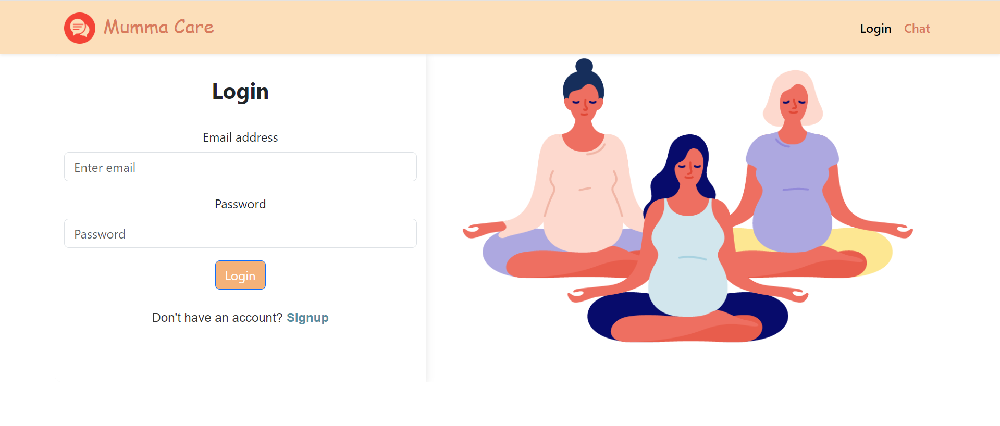
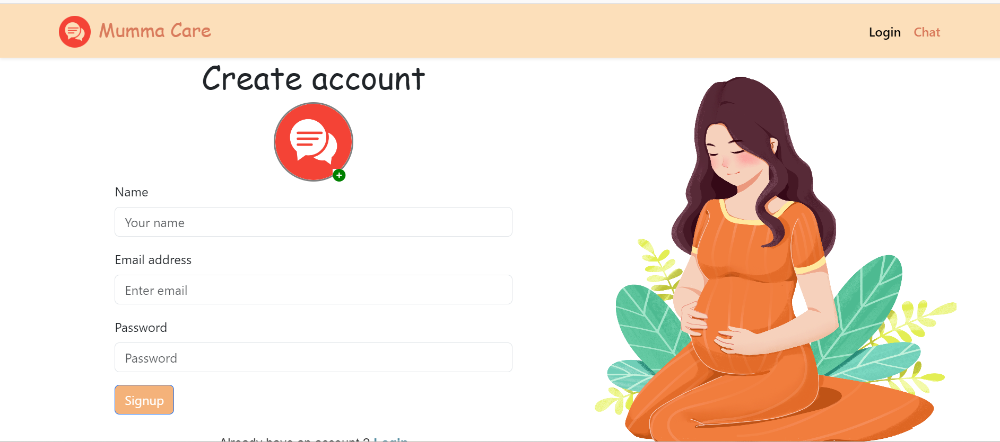
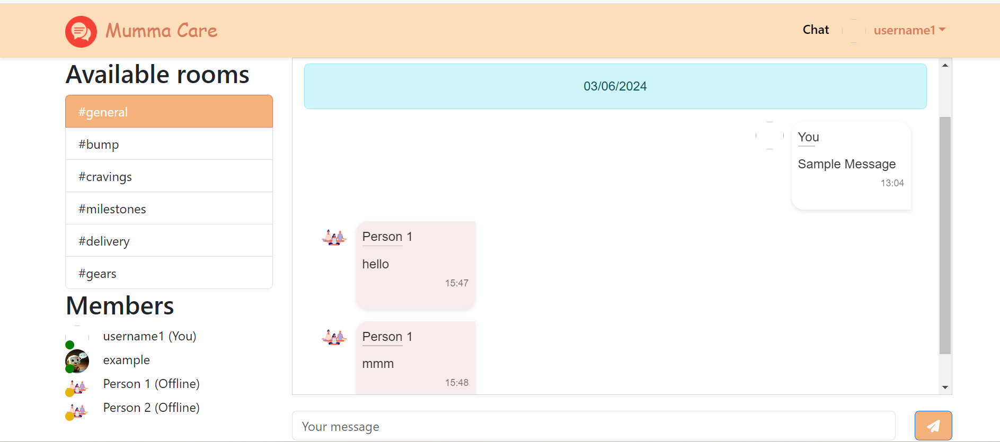

# Real-Time Community Chat Application

## Overview

Welcome to the Real-Time Community Chat Application! This app enables seamless communication through community channels and one-on-one chats. Below, you'll find details on the application's login, signup pages, and chat interfaces.

## Features

- **Login Page**  
    
  Secure login to access your community and personal chat.

- **SignUp Page**  
    
  Easy registration to join the community.

- **Community and One-to-One Chat Interface**  
    
  Engage in community discussions or private conversations with ease.

## Setup Instructions

To run the application locally, follow these steps:

1. **Create Environment Files**  
   - **Backend `.env` file** should contain:
     - `DB_URL`: The database connection URL
     - `PORT`: The port number for the backend server
     - `FRONTEND_URL`: The URL of the front-end application

   - **Frontend `.env` file** should contain:
     - `REACT_APP_API_URL`: The backend API URL
     - `REACT_APP_CLOUDINARY_URL`: The Cloudinary URL for storing profile pictures

2. **Install Dependencies**  
   Navigate to both the front-end and backend folders and install the necessary packages using:

   npm install

3. **Run the Application**
    Start the development servers for both the front-end and backend:
    npm run dev
